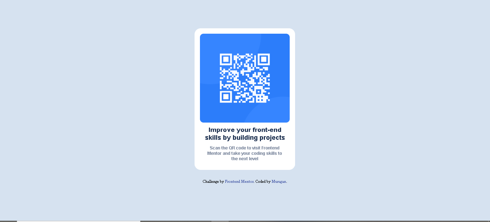
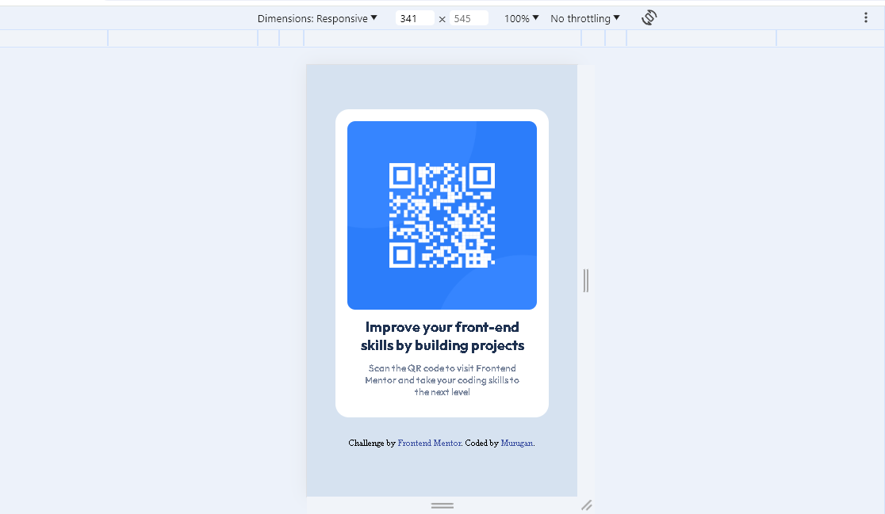

# QR-Component
Here i am making a QR commponent(It is a Frontend mentor challenge)
# Frontend Mentor - QR code component solution

This is a solution to the [QR code component challenge on Frontend Mentor](https://www.frontendmentor.io/challenges/qr-code-component-iux_sIO_H). Frontend Mentor challenges help you improve your coding skills by building realistic projects. 

## Table of contents

- [Overview](#overview)
  - [Screenshot](#screenshot)
  - [Links](#links)
  - [Built with](#built-with)
  - [What I learned](#what-i-learned)
- [Author](#author)

## Overview
   This is my first project in front end mentor website.In this project i am create a QR code component.
### Screenshot

### Links
- Live Site URL: [Add live site URL here](https://murugan008.github.io/QR-Component/)

### Built with

- Semantic HTML5 markup
- CSS custom properties
- Flexbox
- Mobile-first workflow

### What I learned
I learned mobile first work flow from the project.And also I am used and learn flex.

## Author

- Frontend Mentor - [@MURUGAN008](https://www.frontendmentor.io/profile/MURUGAN008)
